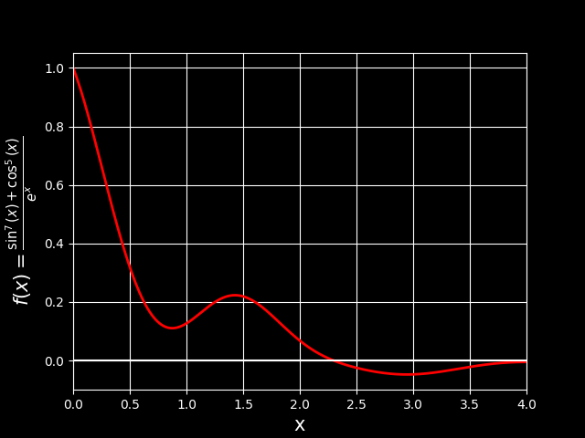
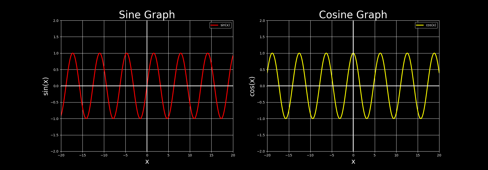

# **IC-252**
    Name: Bhavik Ostwal
    Roll no.: B23395
    Branch: Mathematics and Computing
## Assignment 0 

#### **Question 1**: 
Find out the size of array ’a’, ’b’, and ’c’. In the following code block.
```python
import numpy as np

a = np.array(42)
b = np.array([1, 2, 3, 4, 5])
c = np.array([[1, 2, 3], [4, 5, 6]])

print("Size of arrray a:", a.size)
print("Size of arrray b:", b.size)
print("Size of arrray c:", c.size)
```
--------

#### **Question 2**: 
Bins! Yes binning might be tricky if you want to plot meaningful plots, in the below histogram choose an appropriate binning size, expiriment with the bins style, location, borders and colors. Explore the np.arange function. Add meaningful labels to both axes.
```python
import matplotlib.pyplot as plt
import numpy as np

val=np.random.normal(size=(500), scale=5, loc=30)

bins=np.arange(10,50,2)
# print(bins)

plt.hist(val, bins=bins, edgecolor = 'black', color = 'r')
plt.xlabel('Opening price')
plt.ylabel('Number of occurrences')
plt.title('Normal distribrution')
# plt.xticks(bins)
# plt.grid()
plt.savefig("Q.2.png")
plt.show()
```

----

#### **Question 3**:
Array adressing and slicing. As the dimensions of the array increase it becomes very important how one indexes those arrays, slicing becomes important when one wants to get some desired subpart of a whole array. This Question has two parts.
##### 3.1. Print the sum of left diagonal and right diagonal of a square matrix.
##### 3.2. From the matrix of previous part, print the 3x4 sub-matrix from 1st row 2nd column to 3rd row 5th column. Make use of the array slicing operations preferably , use of for loops is discouraged.
```python
import numpy as np

mat= np.array([[1,3,4,5,2],[1,5,2,4,3],[5,2,3,4,1,],[1,4,2,6,9],[4,5,2,1,7]])
def left_diagonal_sum(mat:np.ndarray)->float:
    sum = 0
    for i in range(len(mat[0])):
        sum += mat[i][i]
    return sum

def right_diagonal_sum(mat:np.ndarray)->float:
    sum = 0
    n = len(mat[0])
    for i in range(n):
        sum += mat[i][n-i-1]
    return sum

print(f"Left Diagonal Sum of\n{mat} is {left_diagonal_sum(mat)}")
print(f"Right Diagonal Sum of\n{mat} is {right_diagonal_sum(mat)}")

def submatrix_3x4(mat: np.ndarray)-> np.ndarray:
    return mat[:3, 1:5]

print(f"The desired submatrix of\n {mat}\n is a {submatrix_3x4(mat).shape} matrix: \n {submatrix_3x4(mat)}")
```
-----
#### **Question 4**: 
Using array operations in np.array and np math functions. Plot the function:
$$f(x) = \frac{\sin^7(x) + \cos^5(x)}{e^x}$$
in the domain:
$$x ∈ [0, 4].$$
Do not use for loops for the same.
```python
import numpy as np
import matplotlib.pyplot as plt

def f(x_inp:np.ndarray):
    return (np.sin(x_inp)**7 +np.cos(x_inp)**5)/np.exp(x_inp)

steps = 0.01
x_inp = np.arange(0,4.01,steps)
# print(x_inp)

plt.rcParams["text.usetex"] = False #set to False so that matplotlib will use its own rendering for Latex (as Latex isn't installed on my system)

# print(plt.style.available)
plt.style.use('dark_background')
plt.plot(x_inp, f(x_inp), color = 'green')
plt.plot(x_inp,np.zeros((401,)), color = 'purple') # showing the x-axis to separate 1st n 4th quadrant
plt.xlim(0,4)
plt.grid()
plt.xlabel('x', fontsize = 15)
plt.ylabel(r'$f(x) = \frac{\sin^7(x) + \cos^5(x)}{e^x}$', fontsize = 15)
plt.savefig("Q.4.png")
# plt.show()
```

-----

#### **Question 5**: 
Create a subplot with two plots side by side. Plot a sine wave in the first subplot. Plot a cosine wave in the second subplot. Add labels, titles, and a legend to the plots.
```python
import numpy as np
import matplotlib.pyplot as plt

x_inp = np.arange(-15*np.pi/2, 15*np.pi/2,0.01)

def sin(x:float):
    return np.sin(x)

def cos(x:float):
    return np.cos(x)

y_sin = sin(x_inp)
y_cos = cos(x_inp)

plt.style.use('dark_background')
plt.figure(figsize=(20,6))

plt.subplot(1,2,1)
plt.title('Sine Graph', fontsize=30)
plt.grid()
plt.plot(x_inp, y_sin,label = 'sin(x)', color = 'red', linewidth = 2)
plt.ylim(-2,2)
plt.xlim(-20,20)
plt.xlabel("x", fontsize=20)
plt.ylabel("sin(x)", fontsize=20)
plt.legend()

plt.subplot(1,2,2)
plt.title('Cosine Graph', fontsize=30 )
plt.grid()
plt.plot(x_inp, y_cos, label = 'cos(x)', color='yellow', linewidth = 2)
plt.xlim(-20,20)
plt.ylim(-2,2)
plt.xlabel("x", fontsize=20)
plt.ylabel("cos(x)", fontsize=20)
plt.legend()
plt.savefig('Q.5.png')
# plt.show()
```
